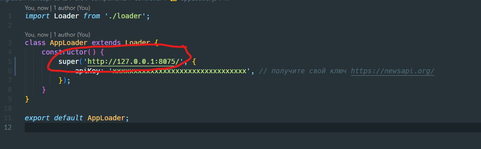

# newsapi-server

## Instructions

- start server with `npm start`. It runs on port 8075 by default
- change server URL in `src/components/controller/appLoader.js` of your application (see screenshot)

